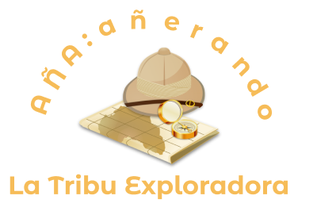
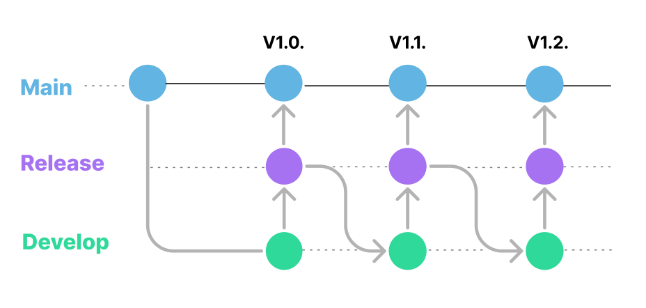

<p align="center">  </p>

## Project's name: Aña añerando la tribu exploradora

## Table of contents

- [General info](#general-info)
- [Technologies](#technologies)
- [Setup](#setup)
- [Versions](#versions)

## General info

This is a project make for Ciudad Industrial del Valle del Nalón, S.A.U. (VALNALÓN). A Web Application as a Game to help kids between 3 to 6 six years old to learn words and vocabulary while they are playing a game. As a software team we have to build an app that allows children learn by doing through techonology.

## Technologies

<div align="center">|                                                                                                                                       Front End                                                                                                                                       |                                                                Back End                                                                 |                                                                                             Diseño y organización                                                                                              |
| :-----------------------------------------------------------------------------------------------------------------------------------------------------------------------------------------------------------------------------------------------------------------------------------: | :-------------------------------------------------------------------------------------------------------------------------------------: | :------------------------------------------------------------------------------------------------------------------------------------------------------------------------------------------------------------: |
|     |   |    |</div>

## Setup

To run this project, install it locally using npm.

Clone the project

```bash
  git clone https://github.com/Equipo-Proton/la-tribu-exploradora-frontend.git
```

Go to the project directory

```bash
  cd la-tribu-exploradora-frontend
```

Install dependencies

```bash
  npm install
```

Start the server

```bash
   npm run dev
```

## Versions

<p align="center">  </p>
Our workflow in git was as follows, we all started from the Main branch with the same base, implementations, changes and features were made in the Develop branch, they were tested in the Release branch and from Release versions with checkpoints were released and updated the Develop branch to continue development with all the features tested and thus not generate a cycle of bugs.

- v1.0.
- v1.1.
- v1.2.

## Visual Design

## Requirements

- [x] App will have some administrators (teachers) and some users (classes). One user is a class.
- [x] Teachers can choose what games are active.
- [x] Users only can play to active games.
- [x] We will build a game.
- [x] Plain design. Adaptative design (children).
- [x] Responsive design (tablet, computer and digital board.
- [x] Project will be 100% scalable and we will can add more games.
- [x] Project will be 100% tested.

## Game description

<ul>
<li>Game consists of numbers and letters.</li>
<li>Numbers available (0-9). Letters available (A-Z).</li>
<li>Admin's screen will start the game and users will have to guess the word, moving the letters.</li>
<li>Admin on his screen will decide correct or wrong and the result will be visual and sound.</li>
</ul>

## Presentation:

<ul>
<li>Readme with:</li>
    <ul>
        <li>Briefing and project explanation.</li>
        <li>Diagrams.</li>
        <li>Sketch - Mockup - Prototype.</li>
    </ul>
<li>Google Slides presentation.</li>
<li>Demo and code review</li>

</ul>

## Work methodology

- TDD
- Agile
- Scrum
- Pair programming

## Documentation

- [Dailys](https://docs.google.com/document/d/1gGHcJYTPoZo_kbkBN_cQCpXgPu5JvurKWr8xd1vH7Lo/edit)
- [Presentation PPTX](https://docs.google.com/presentation/d/1TiQ86Y-N194oHaoAA1V5erXUQw2_3wZ_YzafjYdXoQs/edit?usp=sharing)
- [Prototype](https://www.figma.com/file/HCGDAXOHXuOM567hPHBryR/Proyecto-Pedag%C3%B3gico?node-id=111%3A3)
- [UserFlow](https://www.figma.com/file/R3aFH6bPeETNHazU5k2zO4/Valnal%C3%B3n-User-Flow?node-id=0%3A1)

## Authors

| Nombre                 |     Roll      |  |
| :--------------------- | :-----------: | :----------------------------------------------------------------------------------------------: |
| Kerim Ozkan            | Web Developer |                                    https://github.com/ozknkrm                                    |
| Miguel Salvador        | Web Developer |                             https://github.com/miguelsalvadorrguez85                             |
| Inma González          | Scrum Master  |                                   https://github.com/mimateach                                   |
| Guillermo García       | Web Developer |                                 https://github.com/guillerdev97                                  |
| Juan Francisco Balseca | Product Owner |                                   https://github.com/sudobuda                                    |
| Mario Jiménez          | Web Developer |                                    https://github.com/majifer                                    |

## Acknowledgements

- [Awesome Readme Templates](https://awesomeopensource.com/project/elangosundar/awesome-README-templates)
- [Awesome README](https://github.com/matiassingers/awesome-readme)
- [How to write a Good readme](https://bulldogjob.com/news/449-how-to-write-a-good-readme-for-your-github-project)
