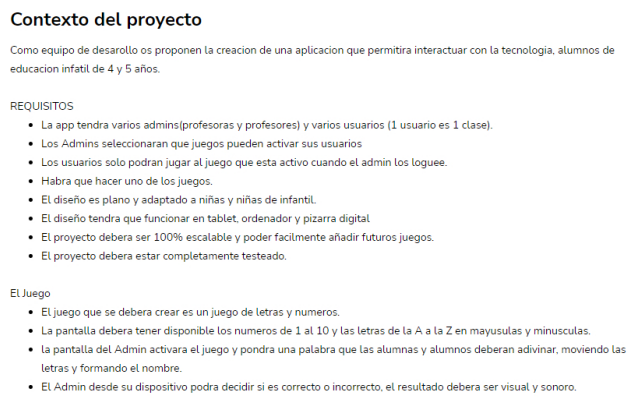

## Requirements

## Project Name: Aña: Añerando la tribu exploradora

## Description
  This is a project make for Ciudad Industrial del Valle del Nalón, S.A.U. (VALNALÓN) that is a Web Application as a Game to help kids between 3 to 6 six years old to learn words and vocabulary while they are playing a game.
  
  
  
## Visual Design: Sketch, MockUp and Prototype

  
  
## Technologies used in this project
### FrontEnd 
  -VUE 3, Bootstrap. Sass, Tailwind
### BackEnd 
  -Php Laravel 9|
  

## Documentation

 
## Authors

| Nombre | Roll |  |
| :--- | :---: | :---: |
| Kerim Ozkan| Web Developer | https://github.com/ozknkrm |
| Miguel Salvador | Web Developer| https://github.com/miguelsalvadorrguez85 |
| Inma González | Scrum Master | https://github.com/mimateach |
| Guillermo García | Web Developer | https://github.com/guillerdev97 |
| Juan Francisco Balseca  | Product Owner| https://github.com/sudobuda |
| Mario Jiménez  | Web Developer| https://github.com/majifer |
